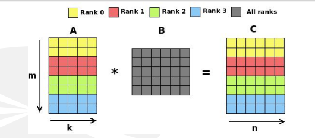

# MatrizCalculatorMultiProccess
Multiplicación de una matriz por otra matriz y escalar usando OpenMPI para hacerlo multiproceso

Ejemplo:



## Instalación

1. Clona ó repositorio:
    ```bash
    git clone https://github.com/vidalmendeznicolas/MatrizCalculatorMultiProcess.git
    ```
2. Tener instalado OpenMPI.
3. Compilar en terminal usando mpicc MatrizMatrizMpi.c -o MatrizMatrizMpi -lm.
4. Ejecutar compilado mpirun --oversubscribe -np proc ./MatrizMatrizMpi m n k alfa test 
proc = Número de procesos
m = Número de filas de la matriz A
n = Número de Columnas de la matriz B
k = Número de filas de la matriz B y columnas de la matriz A
alfa = escalar por el que multiplicar las matrices
test = 1(Mostrar las matrices por pantalla), 0(No mostrarlas)
Ejemplo: mpirun --oversubscribe -np 4 ./MatrizMatrizMpi 2 2 4 1 1 

